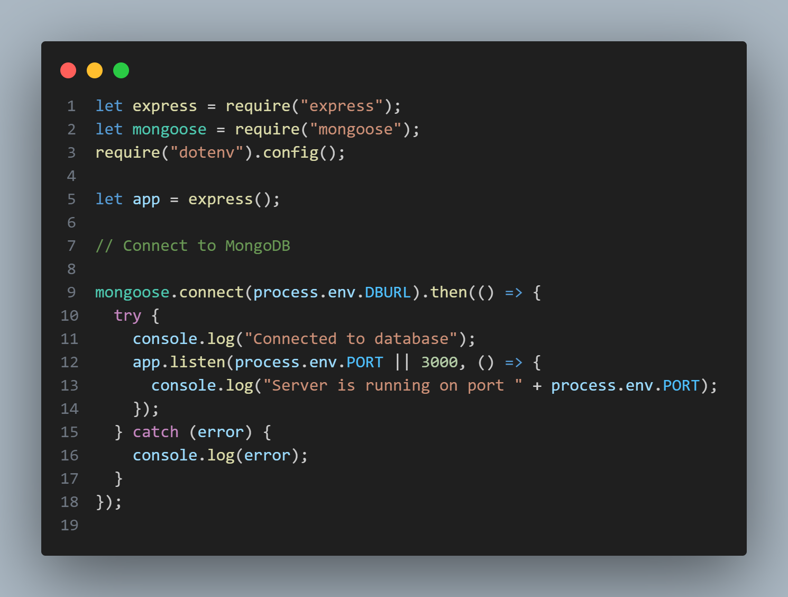

1. Create project folder
2. Create Server and Client Folder
3. Create Client Side Framework using Vite
   1. npm create vite@latest
   2. npm install
   3. install tailwindcss and flowbite following their website
4. Create Server Side Framework
   1. Initalize the package.json file (npm init -y)
   2. Install MERN (npm install express cors dotenv mongoose nodemon)
   
   3. 